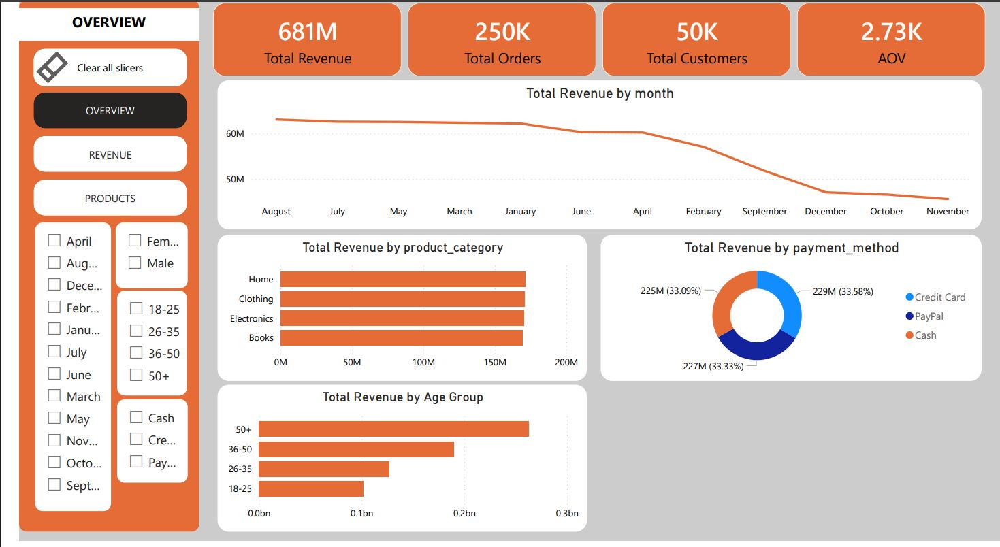
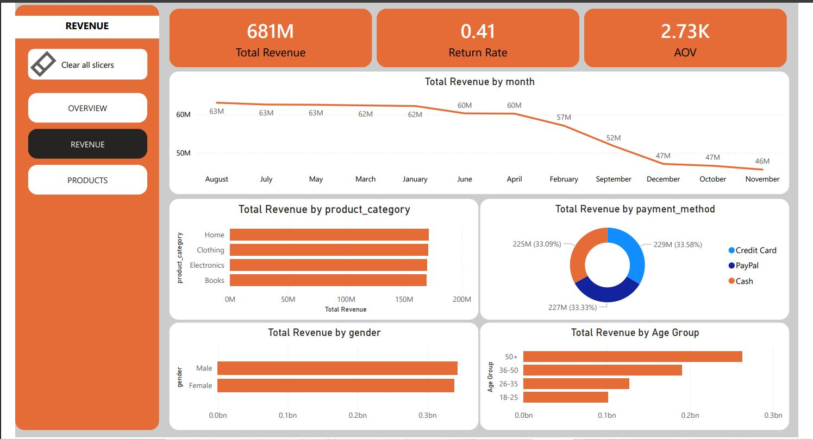
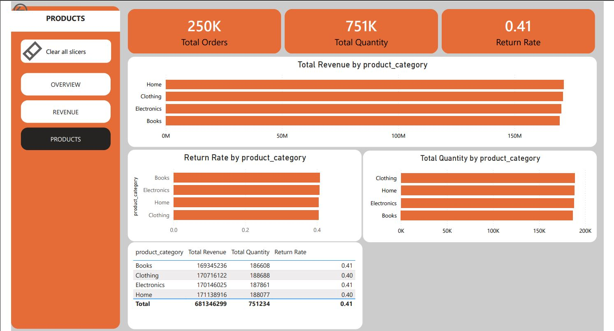

#  Customer Sales & Churn Analysis Dashboard

## Project Overview
This project analyzes customer purchasing behavior, revenue trends, and churn patterns using Python, SQL, and Power BI.

## 🛠 Tools Used
- Python (Pandas)
- SQL
- Power BI

## 📂 Dataset
Customer transaction dataset including:
- Purchase date
- Product category
- Payment method
- Customer demographics
- Churn

## 📊 Dashboard Features
- Revenue analysis
- Customer segmentation
- Product performance
- Churn insights

## 🚀 Key Insights
- Electronics generate the highest revenue
- Customers aged 26–35 are most valuable
- Higher returns may indicate churn risk

##  Dashboard Preview

### Overview Dashboard

### Revenue Dashboard

### Products Dashboard

## 📁 Files Included
- Data cleaning notebook
- SQL queries
- Power BI dashboard
